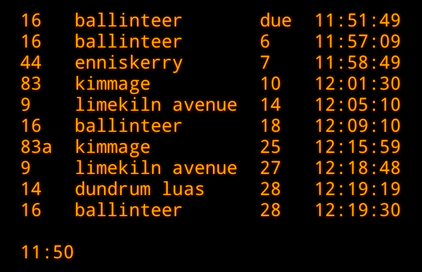

# BUSS

Part II of messing around with the Dublin Bus API.
First get yourself set up with a set of API credentials (see [bus](https://github.com/shawa/bus)).

Now `run.sh <user:pass> <stop number>`. Open `index.html` in a browser and you'll have an auto-refreshing bus sign. *It's just like the ones on the road!*

